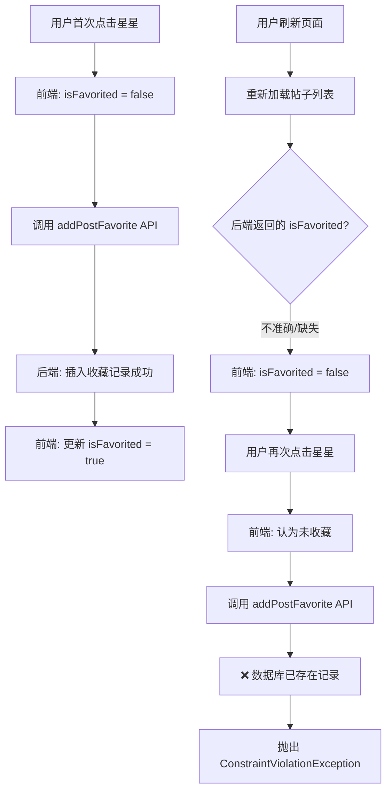
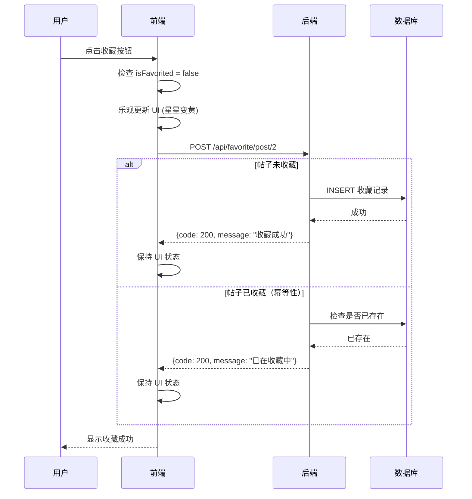

# 🐛 收藏功能约束冲突错误 - 分析与修复

## 📋 错误信息

```
ConstraintViolationException: could not execute statement
constraint [travel_post_favorite.uk_user_post]
```

**错误码**：400 (Bad Request)  
**发生位置**：`/api/favorite/post/2?favoriteCategory=general`  
**操作**：添加收藏（`addPostFavorite`）

---

## 🔍 错误原因分析

### 1. 什么是 `uk_user_post` 约束？

**`uk_user_post`** 是数据库表 `travel_post_favorite` 的**唯一约束**（Unique Constraint），用于确保：

```sql
UNIQUE KEY `uk_user_post` (`user_id`, `post_id`)
```

**作用**：防止同一个用户重复收藏同一篇帖子。

### 2. 为什么会触发约束冲突？

**场景重现**：



### 3. 根本原因

**前后端状态不同步**：

- **前端认为**：帖子未收藏（`isFavorited: false`）
- **后端实际**：数据库已存在收藏记录
- **结果**：前端调用 `addPostFavorite`，后端尝试插入重复记录，触发约束冲突

---

## 🎯 问题定位

### 可能的触发场景

1. **场景 1：后端 API 返回数据不完整**
   ```javascript
   // getPublicPosts API 返回的数据
   {
     id: 2,
     title: "测试帖子",
     isFavorited: undefined  // ❌ 字段缺失或为 undefined
   }
   ```

2. **场景 2：刷新页面前收藏状态同步失败**
   - 用户收藏后，前端状态更新了
   - 但刷新页面后，`getPostFavorites` API 调用失败
   - 导致收藏状态无法正确同步

3. **场景 3：多设备/多标签页操作**
   - 用户在标签页 A 收藏了帖子
   - 在标签页 B 刷新，但状态未同步
   - 在标签页 B 再次点击收藏

---

## ✅ 前端修复方案

我已经实现了以下优化：

### 1. 乐观更新 (Optimistic Update)

**原理**：先更新 UI，再调用 API，失败时回滚

```javascript
// 🌟 乐观更新：先更新 UI
const originalState = post.isFavorited;
setPosts(posts.map(p => 
  p.id === postId 
    ? { ...p, isFavorited: !post.isFavorited }
    : p
));

try {
  // 调用 API
  if (originalState) {
    response = await removePostFavorite(postId);
  } else {
    response = await addPostFavorite(postId, {
      favoriteCategory: 'general'
    });
  }
  
  if (response.code !== 200) {
    // 失败时回滚
    setPosts(posts.map(p => 
      p.id === postId 
        ? { ...p, isFavorited: originalState }
        : p
    ));
  }
} catch (err) {
  // 错误处理
}
```

**优点**：
- ✅ 用户体验更好（即时反馈）
- ✅ 减少延迟感知
- ✅ 失败时可以回滚

### 2. 特殊错误处理

**针对约束冲突的智能处理**：

```javascript
if (err.message && err.message.includes('constraint')) {
  console.warn('⚠️ 检测到约束冲突，可能是状态不同步');
  
  if (!originalState) {
    // 前端认为未收藏，但后端已收藏
    // 保持 UI 为已收藏状态（不回滚）
    console.log('🔄 修正状态为已收藏');
  } else {
    // 其他情况，回滚并提示用户刷新
    setPosts(posts.map(p => 
      p.id === postId 
        ? { ...p, isFavorited: originalState }
        : p
    ));
    alert('操作失败，请刷新页面重试');
  }
}
```

**优点**：
- ✅ 智能识别约束冲突
- ✅ 自动修正前端状态
- ✅ 减少用户困惑

### 3. 已实现的收藏状态同步

在 `loadPosts` 函数中：

```javascript
// 1️⃣ 获取公开帖子列表
const response = await getPublicPosts();

// 2️⃣ 获取用户的收藏列表
const favoritesResponse = await getPostFavorites();
const favoritePostIds = new Set(
  (favoritesResponse.data.list || []).map(fav => fav.postId)
);

// 3️⃣ 更新帖子的收藏状态
const postsWithFavoriteStatus = approvedPosts.map(post => ({
  ...post,
  isFavorited: favoritePostIds.has(post.id)  // ✅ 准确的收藏状态
}));
```

---

## 🔧 后端需要修复的问题

### ⚠️ 问题 1：API 应该返回明确的错误码

**当前情况**：
```json
{
  "code": 400,
  "message": "could not execute statement; SQL [n/a]; constraint..."
}
```

**建议改进**：
```json
{
  "code": 409,  // ✅ 使用 409 Conflict 更语义化
  "message": "该帖子已经被收藏过了",
  "errorCode": "ALREADY_FAVORITED"
}
```

**好处**：
- 前端可以更精确地识别错误类型
- 提供更友好的用户提示
- 符合 RESTful API 设计规范

### ⚠️ 问题 2：API 应该支持幂等性

**建议后端实现幂等性**：

```java
// 伪代码示例
public ResponseDTO addPostFavorite(Long userId, Long postId) {
    // 检查是否已经收藏
    if (favoriteRepository.existsByUserIdAndPostId(userId, postId)) {
        // ✅ 不抛出异常，直接返回成功
        return ResponseDTO.success("该帖子已经在收藏列表中");
    }
    
    // 添加收藏
    Favorite favorite = new Favorite(userId, postId);
    favoriteRepository.save(favorite);
    
    return ResponseDTO.success("收藏成功");
}
```

**好处**：
- ✅ 避免约束冲突异常
- ✅ 提升用户体验（多次点击不报错）
- ✅ 符合幂等性原则

### ⚠️ 问题 3：getPublicPosts API 应该包含准确的 isFavorited

**当前问题**：`getPublicPosts` 返回的帖子列表中，`isFavorited` 字段可能不准确

**建议后端实现**：

```java
// 伪代码示例
public List<PostDTO> getPublicPosts(Long currentUserId) {
    List<Post> posts = postRepository.findAllByAuditStatus("approved");
    
    // ✅ 查询当前用户的收藏列表
    Set<Long> favoritedPostIds = favoriteRepository
        .findAllByUserId(currentUserId)
        .stream()
        .map(Favorite::getPostId)
        .collect(Collectors.toSet());
    
    // ✅ 设置准确的 isFavorited 状态
    return posts.stream()
        .map(post -> {
            PostDTO dto = new PostDTO(post);
            dto.setIsFavorited(favoritedPostIds.contains(post.getId()));
            return dto;
        })
        .collect(Collectors.toList());
}
```

**好处**：
- ✅ 前端无需额外调用 `getPostFavorites`
- ✅ 减少 API 调用次数
- ✅ 状态一致性更好

---

## 📊 数据库表结构建议

### 当前表结构（推测）

```sql
CREATE TABLE travel_post_favorite (
    id BIGINT PRIMARY KEY AUTO_INCREMENT,
    user_id BIGINT NOT NULL,
    post_id BIGINT NOT NULL,
    favorite_category VARCHAR(50),
    created_at DATETIME,
    -- ✅ 唯一约束
    UNIQUE KEY uk_user_post (user_id, post_id)
);
```

**这个设计是合理的**，约束本身没有问题。

### 建议添加索引

```sql
-- 加速收藏状态查询
CREATE INDEX idx_user_id ON travel_post_favorite(user_id);
CREATE INDEX idx_post_id ON travel_post_favorite(post_id);
```

---

## 🧪 测试步骤

### 测试场景 1：正常收藏/取消

1. 登录系统
2. 进入发现页面
3. 点击星星收藏（应该变黄）
4. 再次点击星星取消收藏（应该变灰）
5. **预期**：操作正常，无错误

### 测试场景 2：刷新后收藏

1. 收藏某个帖子
2. 刷新页面
3. 检查星星是否仍然是黄色
4. 点击星星取消收藏
5. **预期**：操作正常，无约束冲突错误

### 测试场景 3：约束冲突处理

1. 手动清空浏览器缓存
2. 在数据库中手动插入一条收藏记录
3. 刷新页面（前端认为未收藏）
4. 点击星星
5. **预期**：
   - 不应该报错给用户
   - 星星应该自动变为黄色
   - 控制台显示"修正状态为已收藏"

---

## 📝 给后端的修复建议

### 优先级 P0（必须修复）

1. **实现幂等性**
   ```
   addPostFavorite API：如果已经收藏，返回成功而不是抛出异常
   ```

2. **返回明确的错误码**
   ```
   约束冲突时，返回 409 Conflict 而不是 400 Bad Request
   ```

### 优先级 P1（强烈建议）

3. **优化 getPublicPosts API**
   ```
   返回的帖子列表中包含准确的 isFavorited 字段
   ```

### 优先级 P2（可选优化）

4. **添加数据库索引**
   ```
   在 user_id 和 post_id 字段上添加索引
   ```

---

## 🔄 完整的交互流程

### 理想流程（修复后）



---

## 📂 修改文件

- `src/components/DiscoverPage.jsx` - 优化收藏逻辑，添加乐观更新和错误处理

---

## 🎯 总结

### 问题本质
前后端状态不同步导致的约束冲突错误。

### 前端已修复
- ✅ 实现乐观更新
- ✅ 添加约束冲突特殊处理
- ✅ 优化错误回滚逻辑
- ✅ 实现收藏状态同步

### 后端需要改进
- ⚠️ 实现 API 幂等性（最重要）
- ⚠️ 返回明确的错误码
- ⚠️ getPublicPosts 包含准确的 isFavorited

---

**修复完成时间**：2025-11-03  
**问题严重程度**：中等（影响用户体验，但已有前端容错）  
**前端状态**：✅ 已优化  
**后端状态**：⚠️ 需要改进

