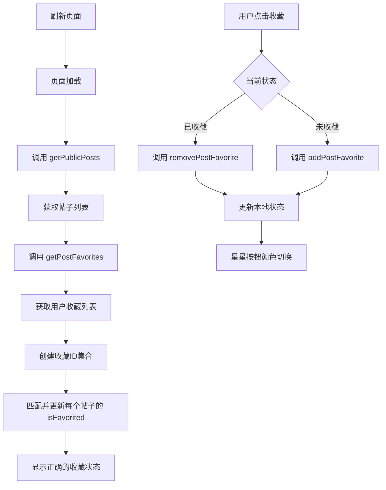

# ✅ 帖子收藏状态刷新问题 - 已修复

## 📋 问题描述

在发现页面的"旅行家精选"模块中，帖子收藏按钮（星星⭐）的状态显示有问题：

- **现象**：用户点击收藏按钮后，星星变黄（已收藏状态）
- **问题**：刷新页面后，星星按钮变灰（未收藏状态）
- **预期**：用户收藏后，星星应该一直保持亮色，直到用户点击取消收藏

---

## 🔍 问题原因

### 根本原因

刷新页面时，`loadPosts` 函数重新从后端获取帖子列表。但是：

1. **后端数据不完整**：`getPublicPosts` API 返回的帖子数据中，`isFavorited` 字段可能：
   - 不存在
   - 或者没有根据当前登录用户正确设置

2. **前端状态丢失**：刷新页面导致前端状态重置，需要重新从后端获取收藏状态

3. **缺少收藏状态同步**：前端没有在加载帖子后主动同步用户的收藏状态

### 代码位置

```jsx
// src/components/DiscoverPage.jsx
const loadPosts = async () => {
  const response = await getPublicPosts();
  // 问题：直接使用后端返回的 isFavorited，但这个字段可能不准确
  setPosts(approvedPosts);
};
```

---

## ✅ 解决方案

### 实现思路

在加载帖子后，**主动调用收藏列表 API**，获取当前用户收藏的所有帖子 ID，然后与展示的帖子进行匹配，更新 `isFavorited` 状态。

### 步骤

1. **导入收藏列表 API**
2. **在加载帖子后调用收藏列表 API**
3. **创建收藏帖子 ID 的集合**
4. **匹配并更新每个帖子的收藏状态**

---

## 📝 代码修改

### 1. 导入 `getPostFavorites` API

```jsx
import { 
  getPublicPosts, 
  togglePostLike, 
  addPostFavorite, 
  removePostFavorite,
  getPostFavorites  // ✅ 新增
} from '../api/config';
```

### 2. 修改 `loadPosts` 函数

```jsx
const loadPosts = async () => {
  try {
    setLoading(true);
    setError(null);
    
    // 1️⃣ 获取公开帖子列表
    const response = await getPublicPosts();
    if (response.code === 200) {
      const allPosts = response.data.list || [];
      const approvedPosts = allPosts.filter(post => post.auditStatus === 'approved');
      
      // 2️⃣ 获取用户的收藏列表
      try {
        const favoritesResponse = await getPostFavorites();
        if (favoritesResponse.code === 200) {
          // 创建收藏帖子 ID 的集合（使用 Set 提高查询效率）
          const favoritePostIds = new Set(
            (favoritesResponse.data.list || []).map(fav => fav.postId)
          );
          
          console.log('⭐ 用户收藏的帖子:', Array.from(favoritePostIds));
          
          // 3️⃣ 更新帖子的收藏状态
          const postsWithFavoriteStatus = approvedPosts.map(post => ({
            ...post,
            isFavorited: favoritePostIds.has(post.id)  // ✅ 正确设置收藏状态
          }));
          
          setPosts(postsWithFavoriteStatus);
        } else {
          console.warn('⚠️ 获取收藏列表失败，收藏状态可能不准确');
          setPosts(approvedPosts);
        }
      } catch (favErr) {
        console.warn('⚠️ 获取收藏列表失败:', favErr.message);
        setPosts(approvedPosts);
      }
    }
  } catch (err) {
    console.error('加载帖子失败:', err);
    setError(err.message);
    setPosts([]);
  } finally {
    setLoading(false);
  }
};
```

---

## 🎯 修复效果

### 修复前
- ❌ 刷新页面后，所有收藏的帖子星星变灰
- ❌ 用户需要重新点击收藏
- ❌ 收藏状态不持久化

### 修复后
- ✅ 刷新页面后，已收藏的帖子星星保持黄色（亮色）
- ✅ 收藏状态正确同步
- ✅ 用户体验流畅，无需重复操作

---

## 🔄 工作流程

### 完整的收藏流程



### API 调用顺序

1. **页面加载时**
   ```
   getPublicPosts() → 获取所有审核通过的帖子
   getPostFavorites() → 获取当前用户的收藏列表
   匹配 → 更新 isFavorited 状态
   ```

2. **用户点击收藏时**
   ```
   addPostFavorite(postId) → 添加到收藏
   或
   removePostFavorite(postId) → 从收藏移除
   更新本地状态 → 立即反馈UI
   ```

---

## 🧪 测试步骤

### 测试场景 1：收藏后刷新
1. 登录系统
2. 进入发现页面
3. 点击某个帖子的星星收藏按钮（星星变黄）
4. 刷新页面（F5 或 Ctrl+R）
5. **预期结果**：星星保持黄色（已收藏状态）

### 测试场景 2：取消收藏后刷新
1. 在已收藏的帖子上点击星星取消收藏（星星变灰）
2. 刷新页面
3. **预期结果**：星星保持灰色（未收藏状态）

### 测试场景 3：多个帖子收藏
1. 收藏 3 个不同的帖子
2. 刷新页面
3. **预期结果**：所有 3 个帖子的星星都保持黄色

### 测试场景 4：登出重新登录
1. 用户 A 登录，收藏若干帖子
2. 用户 A 登出
3. 用户 B 登录
4. **预期结果**：用户 B 看到的是自己的收藏状态，不是用户 A 的

---

## 📊 数据结构

### getPostFavorites 返回格式

```json
{
  "code": 200,
  "message": "success",
  "data": {
    "list": [
      {
        "id": 1,
        "userId": 123,
        "postId": 456,  // ✅ 关键字段：收藏的帖子ID
        "favoriteCategory": "general",
        "createdAt": "2025-11-03T10:00:00Z"
      },
      // ... 更多收藏记录
    ]
  }
}
```

### 收藏状态匹配逻辑

```javascript
// 从收藏列表中提取所有 postId
const favoritePostIds = new Set([456, 789, 101]); // 示例

// 检查某个帖子是否被收藏
post.isFavorited = favoritePostIds.has(post.id);
```

---

## 🔧 技术亮点

### 1. 使用 Set 数据结构

```javascript
const favoritePostIds = new Set(
  (favoritesResponse.data.list || []).map(fav => fav.postId)
);
```

**优点**：
- `Set.has()` 查询时间复杂度为 O(1)
- 比数组的 `includes()` 更高效（O(n)）
- 适合大量帖子的场景

### 2. 容错处理

```javascript
try {
  const favoritesResponse = await getPostFavorites();
  // 处理收藏列表
} catch (favErr) {
  console.warn('⚠️ 获取收藏列表失败:', favErr.message);
  // 即使收藏API失败，仍然显示帖子
  setPosts(approvedPosts);
}
```

**优点**：
- 收藏API失败不影响帖子展示
- 用户仍然可以浏览内容
- 优雅降级策略

### 3. 调试日志

```javascript
console.log('⭐ 用户收藏的帖子:', Array.from(favoritePostIds));
```

**优点**：
- 方便开发调试
- 快速定位问题
- 清晰的日志标识（使用 emoji）

---

## 🚨 注意事项

1. **API 依赖**
   - 确保后端 `getPostFavorites` API 正常工作
   - 需要正确返回当前登录用户的收藏列表

2. **性能考虑**
   - 每次加载帖子都会调用两个 API
   - 如果帖子数量很大，考虑分页加载
   - 可以添加缓存机制优化性能

3. **用户体验**
   - 加载过程中显示 loading 状态
   - 收藏操作应该有即时反馈
   - 网络错误时给出友好提示

---

## 📂 修改文件

- `src/components/DiscoverPage.jsx` - 修改帖子加载逻辑，添加收藏状态同步

---

## 🔮 未来优化建议

1. **后端优化**
   - 建议后端在 `getPublicPosts` API 中直接包含当前用户的收藏状态
   - 减少前端 API 调用次数

2. **缓存机制**
   - 使用 localStorage 或 sessionStorage 缓存收藏列表
   - 减少重复 API 调用

3. **实时同步**
   - 考虑使用 WebSocket 实时同步收藏状态
   - 多设备登录时保持状态一致

---

**修复完成时间**：2025-11-03  
**问题严重程度**：中等（影响用户体验和数据准确性）  
**修复状态**：✅ 已完成

