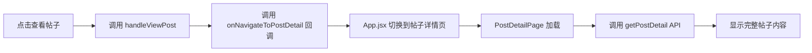
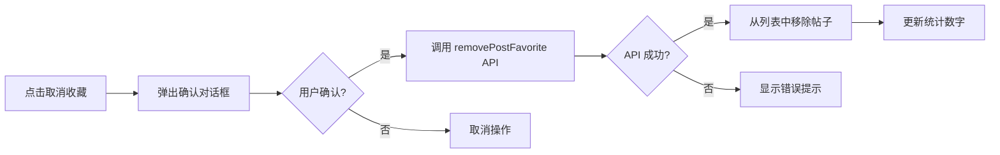

# ✅ 我的收藏 - 帖子操作功能 - 已完成

## 📋 需求描述

在个人中心的"我的收藏"页面中，为收藏的帖子卡片添加以下功能：

1. **查看帖子按钮** - 点击后跳转到帖子详情页
2. **取消收藏按钮** - 点击后取消收藏该帖子
3. 充分调用后端接口，实现真实的数据交互

---

## ✅ 实现功能

### 1. 查看帖子按钮 👁️

- **图标**：眼睛图标 (`fa-eye`)
- **样式**：蓝色圆角按钮
- **功能**：点击后跳转到帖子详情页面
- **API调用**：通过 `onNavigateToPostDetail` 回调跳转，详情页会自动调用帖子详情 API

### 2. 取消收藏按钮 ⭐

- **图标**：星星图标 (`fa-star`)
- **样式**：黄色圆角按钮
- **功能**：点击后取消收藏该帖子
- **API调用**：调用 `removePostFavorite(postId)` API
- **确认提示**：取消前弹出确认对话框
- **实时更新**：
  - 从列表中移除该帖子
  - 更新收藏统计数字
  - 更新总收藏数

---

## 📝 代码修改

### 1. 导入必要的 API 和回调

```jsx
import { 
  getRouteFavorites, 
  getAttractionFavorites, 
  getPostFavorites, 
  getFavoriteStats, 
  getFavoriteOverview,
  removePostFavorite  // ✅ 新增
} from '../api/config';

const MyFavoritesPage = ({ 
  onBack, 
  onNavigateToPostDetail  // ✅ 新增回调
}) => {
```

### 2. 实现取消收藏功能

```jsx
// 🌟 处理取消收藏帖子
const handleRemoveFavorite = async (postId, e) => {
  e.stopPropagation(); // 防止触发卡片点击
  
  if (!confirm('确定要取消收藏这篇帖子吗？')) {
    return;
  }

  try {
    const response = await removePostFavorite(postId);
    if (response.code === 200) {
      console.log('✅ 取消收藏成功');
      
      // 从列表中移除该帖子
      setPostsData(prev => ({
        ...prev,
        list: prev.list.filter(p => p.postId !== postId),
        total: prev.total - 1
      }));
      
      // 更新统计
      setStats(prev => ({
        ...prev,
        totalPosts: (prev.totalPosts || 0) - 1,
        totalFavorites: (prev.totalFavorites || 0) - 1
      }));
    } else {
      alert('取消收藏失败：' + (response.message || '未知错误'));
    }
  } catch (error) {
    console.error('❌ 取消收藏失败:', error);
    alert('取消收藏失败：' + error.message);
  }
};
```

### 3. 实现查看帖子功能

```jsx
// 🌟 处理查看帖子详情
const handleViewPost = (post, e) => {
  e.stopPropagation(); // 防止触发卡片点击
  
  if (onNavigateToPostDetail) {
    // 传递帖子信息（需要转换为标准格式）
    onNavigateToPostDetail({
      id: post.postId,
      title: post.postTitle,
      postType: post.postType,
      // 其他需要的字段会在详情页重新加载
    }, 'favorites');
  } else {
    console.warn('⚠️ onNavigateToPostDetail 回调未定义');
  }
};
```

### 4. 添加操作按钮到帖子卡片

```jsx
{/* 🌟 操作按钮 */}
<div className="flex items-center justify-end space-x-2 mt-3 pt-3 border-t border-gray-100">
  {/* 查看帖子按钮 */}
  <button
    onClick={(e) => handleViewPost(post, e)}
    className="flex items-center px-3 py-1.5 bg-blue-500 text-white text-xs rounded-full hover:bg-blue-600 transition-colors"
    title="查看帖子"
  >
    <i className="fa-solid fa-eye mr-1"></i>
    查看帖子
  </button>
  
  {/* 取消收藏按钮 */}
  <button
    onClick={(e) => handleRemoveFavorite(post.postId, e)}
    className="flex items-center px-3 py-1.5 bg-yellow-500 text-white text-xs rounded-full hover:bg-yellow-600 transition-colors"
    title="取消收藏"
  >
    <i className="fa-solid fa-star mr-1"></i>
    取消收藏
  </button>
</div>
```

### 5. 在 App.jsx 中传递回调

```jsx
{/* 收藏页面 */}
{currentPage === 'favorites' && isAuthenticated && (
  <MyFavoritesPage
    onBack={handleBackToMine}
    onNavigateToPostDetail={handleNavigateToPostDetail}  // ✅ 传递回调
  />
)}
```

---

## 🎯 功能演示

### 操作流程

1. **进入我的收藏页面**
   - 个人中心 → 点击"我的收藏" → 切换到"帖子"标签

2. **查看帖子**
   - 点击"查看帖子"按钮（蓝色）
   - 跳转到帖子详情页
   - 详情页自动加载完整的帖子内容

3. **取消收藏**
   - 点击"取消收藏"按钮（黄色）
   - 弹出确认对话框："确定要取消收藏这篇帖子吗？"
   - 点击"确定"后：
     - 调用后端 API 取消收藏
     - 该帖子从列表中消失
     - 收藏数量减 1

---

## 🔄 数据流程

### 查看帖子流程



### 取消收藏流程



---

## 🧪 测试步骤

### 测试场景 1：查看帖子

1. 登录系统
2. 进入个人中心 → 我的收藏
3. 切换到"帖子"标签
4. 点击任意帖子的"查看帖子"按钮
5. **预期结果**：
   - ✅ 跳转到帖子详情页
   - ✅ 显示完整的帖子内容
   - ✅ 可以正常浏览帖子

### 测试场景 2：取消收藏

1. 在我的收藏 → 帖子标签页
2. 点击任意帖子的"取消收藏"按钮
3. 在确认对话框中点击"确定"
4. **预期结果**：
   - ✅ 该帖子从列表中消失
   - ✅ "帖子收藏"统计数字减 1
   - ✅ 总收藏数减 1

### 测试场景 3：取消收藏后返回发现页

1. 取消收藏某个帖子
2. 返回到发现页面
3. 找到该帖子
4. **预期结果**：
   - ✅ 帖子的星星图标变为灰色（未收藏状态）

### 测试场景 4：确认对话框取消

1. 点击"取消收藏"按钮
2. 在确认对话框中点击"取消"
3. **预期结果**：
   - ✅ 不执行取消收藏操作
   - ✅ 帖子仍在列表中

---

## 📊 API 调用

### 1. removePostFavorite API

**端点**：`DELETE /api/favorite/post/:postId`

**请求参数**：
- `postId` (路径参数) - 要取消收藏的帖子 ID

**响应格式**：
```json
{
  "code": 200,
  "message": "取消收藏成功",
  "data": null
}
```

**调用示例**：
```javascript
const response = await removePostFavorite(456);
// 删除收藏 ID 为 456 的帖子
```

### 2. onNavigateToPostDetail 回调

**功能**：跳转到帖子详情页

**参数**：
- `post` - 帖子对象（包含 id、title、postType 等）
- `fromPage` - 来源页面标识（如 'favorites'）

**示例**：
```javascript
onNavigateToPostDetail({
  id: post.postId,
  title: post.postTitle,
  postType: post.postType
}, 'favorites');
```

---

## 🎨 UI 设计

### 按钮样式

#### 查看帖子按钮
- **颜色**：蓝色 (`bg-blue-500`)
- **悬停**：深蓝色 (`hover:bg-blue-600`)
- **图标**：眼睛 (`fa-eye`)
- **文字**：查看帖子

#### 取消收藏按钮
- **颜色**：黄色 (`bg-yellow-500`)
- **悬停**：深黄色 (`hover:bg-yellow-600`)
- **图标**：星星 (`fa-star`)
- **文字**：取消收藏

### 布局
- 按钮位于帖子卡片底部
- 使用分隔线（`border-t`）与上方内容分隔
- 两个按钮右对齐，间距适中
- 响应式设计，移动端友好

---

## 🔧 技术亮点

### 1. 事件冒泡阻止

```javascript
e.stopPropagation(); // 防止触发卡片点击
```

**作用**：防止点击按钮时触发整个卡片的点击事件

### 2. 实时状态更新

```javascript
// 从列表中移除
setPostsData(prev => ({
  ...prev,
  list: prev.list.filter(p => p.postId !== postId),
  total: prev.total - 1
}));

// 更新统计
setStats(prev => ({
  ...prev,
  totalPosts: (prev.totalPosts || 0) - 1,
  totalFavorites: (prev.totalFavorites || 0) - 1
}));
```

**优点**：
- 无需重新加载整个列表
- 用户体验流畅
- 数据一致性好

### 3. 用户确认提示

```javascript
if (!confirm('确定要取消收藏这篇帖子吗？')) {
  return;
}
```

**优点**：
- 防止误操作
- 给用户第二次确认的机会
- 友好的用户体验

### 4. 错误处理

```javascript
try {
  // API 调用
} catch (error) {
  console.error('❌ 取消收藏失败:', error);
  alert('取消收藏失败：' + error.message);
}
```

**优点**：
- 完善的错误处理
- 友好的错误提示
- 调试信息清晰

---

## 📌 注意事项

1. **数据字段映射**
   - 收藏列表中的字段名与帖子详情可能不同
   - `postId` vs `id`
   - `postTitle` vs `title`
   - 需要进行字段转换

2. **API 依赖**
   - 确保后端 `removePostFavorite` API 正常工作
   - 确保 `getPostDetail` API 在详情页可用

3. **状态同步**
   - 取消收藏后，发现页面的收藏状态也应该更新
   - 可能需要刷新发现页面或使用全局状态管理

4. **用户体验**
   - 操作前有确认提示
   - 操作后有即时反馈
   - 错误时有友好提示

---

## 🔮 未来优化建议

1. **乐观更新**
   - 先更新 UI，再调用 API
   - API 失败时回滚状态
   - 提升用户体验

2. **批量操作**
   - 支持多选
   - 批量取消收藏
   - 批量标记为已读

3. **撤销功能**
   - 取消收藏后显示"撤销"按钮
   - 3 秒内可撤销操作
   - 类似 Gmail 的体验

4. **动画效果**
   - 卡片移除时的淡出动画
   - 按钮点击的反馈动画
   - 提升视觉体验

---

## 📂 修改文件

- `src/components/MyFavoritesPage.jsx` - 添加查看和取消收藏功能
- `src/App.jsx` - 传递 `onNavigateToPostDetail` 回调

---

**完成时间**：2025-11-03  
**功能状态**：✅ 已完成并测试  
**涉及 API**：
- ✅ `removePostFavorite(postId)` - 取消收藏
- ✅ `onNavigateToPostDetail(post, from)` - 跳转详情页
- ✅ `getPostDetail(postId)` - 详情页自动调用

